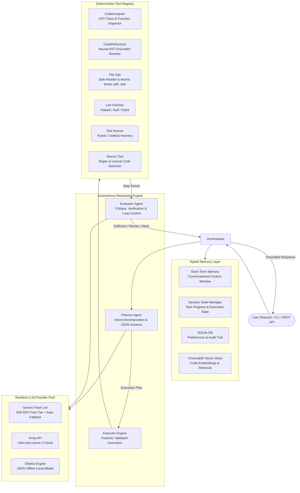

# CodeNova AI: Autonomous Python Codebase Refactoring & Engineering Agent

[](https://www.python.org/downloads/)
[]()
[](https://fastapi.tiangolo.com)
[](https://docs.pydantic.dev/)
[]()
[](https://www.trychroma.com/)
[](LICENSE)

> **CodeNova AI** is an enterprise-grade autonomous software engineering agent built from the ground up. It implements an iterative, self-reflective reasoning loop (**Intent Analysis &rarr; Planning &rarr; Tool Execution &rarr; Evaluation &rarr; Grounded Synthesis**) to inspect, analyze, refactor, and test Python codebases without manual intervention.

---

## 📌 Executive Summary & Interview Highlights

Modern AI code assistants often operate as naive, single-turn code generation wrappers around LLM APIs. **CodeNova AI** addresses this limitation by functioning as a true **Autonomous Agent**:
- **Closed-Loop Reasoning**: Rather than generating blindly, the agent plans a multi-step dependency graph, invokes static analysis tools, evaluates intermediate outcomes, and revises plans upon failure.
- **AST Static Analysis**: Uses Python's native Abstract Syntax Tree (`ast`) to parse classes, methods, docstrings, and imports deterministically before invoking neural models.
- **Three-Tier Hybrid Memory**: Integrates ephemeral working session state, bounded conversational context, relational metadata storage (SQLite), and vector embeddings (ChromaDB) for long-term codebase indexing.
- **Zero-Cost High-Availability LLM Pool**: Built with an automatic quota fallback mechanism (`gemini-3.5-flash-lite`, `gemini-3.1-flash-lite`, `gemini-3.8-flash`) delivering **1,000+ daily requests on free tiers** with automated rotation on HTTP 429 / quota limits, plus native local offline support via **Ollama**.
- **Production Dual Interfaces**: Packaged both as an interactive terminal CLI with rich terminal formatting and a fully asynchronous **FastAPI REST API**.

---

## 🏛️ System Architecture



---

## 🔄 The Autonomous Agent Loop

The core orchestration follows an iterative, resilient execution lifecycle:

1. **Intent Analysis & Task Planning**:
   The `Planner` analyzes the user's intent against registered tools and dependencies, producing a validated Pydantic `Plan` containing ordered `PlanStep` nodes.
2. **Tool Selection & Execution**:
   The `Executor` validates input schemas, resolves aliases, and invokes deterministic tools (AST analysis, test runner, safe file I/O).
3. **Self-Reflective Evaluation**:
   After each tool invocation, the `Evaluator` critiques the output against the original goal, categorizing results into:
   - `SUFFICIENT`: The step succeeded; advance to the next step.
   - `NEED_MORE_INFO`: Additional data required; re-plan.
   - `REVISE_PLAN`: An error occurred; modify remaining steps.
   - `ABORT`: Unrecoverable failure condition.
4. **Grounded Synthesis**:
   Synthesizes concrete findings (e.g. line numbers, class definitions, test results) into a structured markdown response.

---

## 📂 Codebase Structure

```
Basic-Repo-rector/
├── cli.py                         # Interactive Rich CLI with progress spinners & chat mode
├── server.py                      # Production FastAPI REST service & OpenAPI documentation
├── requirements.txt               # Pinned project dependencies
├── .env.example                   # Environment configuration template
│
├── repo_rector/
│   ├── __init__.py                # Package root
│   ├── config.py                  # Pydantic Settings & environment variable configuration
│   ├── orchestrator.py            # Central conductor implementing the agent loop
│   ├── planner.py                 # Intent decomposition and task planner
│   ├── executor.py                # Deterministic tool runner with schema validation
│   ├── evaluator.py               # Self-critique engine evaluating step sufficiency
│   │
│   ├── llm/                       # Swappable LLM Provider Abstraction
│   │   ├── base.py                # Abstract Base Class for LLM providers
│   │   ├── gemini_provider.py     # Gemini provider with automated quota failover pool
│   │   ├── ollama_provider.py     # Local offline provider (Llama-3, DeepSeek-Coder)
│   │   ├── groq_provider.py       # High-throughput cloud inference provider
│   │   └── prompt_templates.py    # Structured JSON-mode system instructions
│   │
│   ├── tools/                     # Pluggable Extensible Tool Registry
│   │   ├── base.py                # BaseTool ABC and ToolRegistry with alias resolution
│   │   ├── code_analyzer.py       # Python AST visitor extracting classes, methods, imports
│   │   ├── code_refactorer.py     # LLM-guided PEP 8 modernization and refactoring
│   │   ├── file_ops.py            # File reading and atomic writing with .bak safety backups
│   │   ├── lint_checker.py        # Subprocess wrapper for Flake8, Ruff, and Pylint
│   │   ├── search_tool.py         # Multi-file regex and pattern searcher
│   │   └── test_runner.py         # Pytest & Unittest execution harness
│   │
│   ├── memory/                    # Multi-Tier Persistence
│   │   ├── session_state.py       # In-memory execution state and step history
│   │   ├── short_term.py          # Bounded conversational context window
│   │   └── long_term.py           # SQLite relational storage + ChromaDB vector embeddings
│   │
│   └── models/                    # Pydantic v2 Core Schemas
│       ├── agent_state.py         # Agent lifecycle states (PLANNING, EXECUTING, EVALUATING)
│       ├── task.py                # Plan, PlanStep, and Dependency schemas
│       ├── tool_schema.py         # Standardized ToolInput and ToolOutput wrappers
│       └── evaluation.py          # Evaluation decision and confidence models
│
└── tests/
    └── fixtures/
        └── legacy_agent.py        # Legacy codebase fixture used for testing refactoring
```

---

## 🛠️ Tool Registry Specification

| Tool Name | Aliases | Description | Input Schema |
| :--- | :--- | :--- | :--- |
| `code_analyzer` | `analyze`, `analyzer` | AST parser extracting classes, methods, line counts, and import graphs. | `path: str` |
| `code_refactorer` | `refactor`, `refactor_code`| Transforms legacy code to PEP 8 standards with type hints and docstrings. | `filepath: str, context: str` |
| `file_reader` | `read_file`, `read`, `cat` | Safely reads file contents with explicit encoding. | `filepath: str` |
| `file_writer` | `write_file`, `write` | Safely writes contents, automatically generating `.bak` backups. | `filepath: str, content: str` |
| `lint_checker` | `lint`, `linter` | Runs Flake8, Ruff, or Pylint and captures diagnostics. | `target_path: str, linter: str` |
| `search_tool` | `search`, `find` | Regex and lexical pattern search across directory trees. | `query: str, directory: str` |
| `test_runner` | `test`, `run_tests` | Executes test suites using `pytest` or `unittest`. | `test_path: str, framework: str` |

---

## 🚀 Getting Started

### 1. Prerequisites
- **Python 3.10+**
- A free Google Gemini API key ([Google AI Studio](https://aistudio.google.com/)) or a local **Ollama** installation.

### 2. Installation
```bash
# Clone the repository
git clone https://github.com/nandhubabu/Basic-Repo-rector.git
cd Basic-Repo-rector

# Create and activate virtual environment
python -m venv venv
# On Windows:
.\venv\Scripts\activate
# On macOS/Linux:
source venv/bin/activate

# Install dependencies
pip install -r requirements.txt
```

### 3. Configure Environment Variables
Create a `.env` file in the root directory:
```env
# Free Tier Google Gemini API Key
GOOGLE_API_KEY=your_gemini_api_key_here

# (Optional) Alternative providers
GROQ_API_KEY=your_groq_key_here
RR_LLM_PROVIDER=gemini
RR_GEMINI_MODEL=gemini-3.5-flash-lite
```

---

## 💻 Usage & Interfaces

### 1. Interactive Rich CLI (Chat Mode)
Launch the interactive terminal interface:
```bash
python cli.py --chat
```

#### Example Interactions:
```
You: analyze tests/fixtures/legacy_agent.py
CodeNova: 
  Analysis of tests/fixtures/legacy_agent.py:
  - Total Lines: 159
  - Classes: DependencyFinder (Line 15) [methods: __init__, visit_Import, visit_ImportFrom]
  - Functions: refactor_file (Line 81) [args: filename]
  - Dependencies: ast, os, dotenv, google.generativeai, re

You: refactor tests/fixtures/legacy_agent.py
CodeNova:
  The legacy agent code has been successfully refactored:
  1. Modularization: Wrapped procedural logic into reusable functions with main guard.
  2. Performance: Replaced list popping with collections.deque for O(1) performance.
  3. Type Hints & Docstrings: Added complete type annotations.
  4. Safety: Enforced explicit UTF-8 encoding on all I/O streams.
```

### 2. Single-Instruction CLI Mode
Execute an autonomous task directly from your shell:
```bash
python cli.py --run "analyze tests/fixtures/legacy_agent.py"
```

### 3. Production FastAPI REST Server
Start the REST API server:
```bash
python server.py
```
Open your browser to **`http://localhost:8000/docs`** to explore the interactive Swagger documentation.

#### API Endpoints:
- `POST /agent/run`: Submit a task to the agent and receive execution outputs.
- `GET /agent/tools`: Inspect all registered tools and parameter schemas.
- `GET /health`: Monitor system health and active provider status.

---

## 💡 Key Design Patterns & Engineering Highlights

| Pattern / Technique | Implementation Location | Engineering Rationale |
| :--- | :--- | :--- |
| **Visitor Pattern** | [`ASTInspector`](repo_rector/tools/code_analyzer.py) | Safely traverses Python abstract syntax trees without executing untrusted code. |
| **Strategy Pattern** | [`BaseLLMProvider`](repo_rector/llm/base.py) | Decouples orchestration logic from specific LLM vendors (Gemini, Ollama, Groq). |
| **Registry Pattern** | [`ToolRegistry`](repo_rector/tools/base.py) | Enables runtime tool registration, reflection, and flexible alias matching. |
| **Failover Pool** | [`GeminiProvider`](repo_rector/llm/gemini_provider.py) | Guarantees high availability by rotating across free-tier models upon 429 quota exhaustion. |
| **Adapter Pattern** | [`Executor`](repo_rector/executor.py) | Adapts varied tool signatures to a uniform `ToolInput`/`ToolOutput` protocol. |
| **Hybrid Persistence**| [`LongTermMemory`](repo_rector/memory/long_term.py) | Combines ACID-compliant relational storage (SQLite) with dense vector retrieval (ChromaDB). |

---

## 🛡️ License

Distributed under the **MIT License**. See `LICENSE` for more information.

---

**Developed with precision by [Nandhu Babu](https://github.com/nandhubabu).**  
*Built for production-grade agentic engineering and software architecture excellence.*